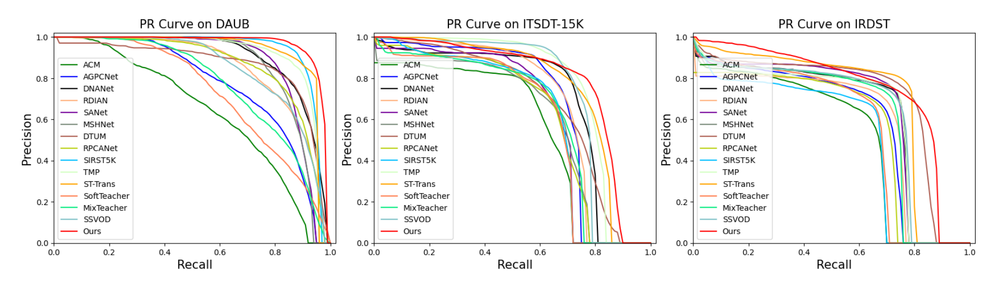

# SeViL
[AAAI 26] SeViL: Semi-supervised Vision-Language Learning with Text Prompt Guiding for Moving Infrared Small Target Detection


## Introduction
Unlike traditional object detection, moving infrared small target detection is highly challenging due to tiny target size and limited labeled samples. Currently, most existing methods mainly focus on the pure-vision features usually by fully-supervised learning, heavily relying on extensive high-cost manual annotations. Moreover, they almost have not concerned the potentials of multi-modal (e.g., vision and text) learning yet. To address these issues, inspired by prevalent vision-language models, we propose the first semi-supervised vision-language (SeViL) framework with adaptive text prompt guiding. Breaking through traditional pure-vision modality, it takes text prompts as prior knowledge to adaptively enhance target regions and then filter the low-quality pseudo-labels generated on unlabeled data. In the meanwhile, we employ an adaptive cross-modal masking strategy to align text and vision features, promoting cross-modal deep interactions. Remarkably, our extensive experiments on three public datasets (DAUB, ITSDT-15K and IRDST) verify that our new scheme could outperform other semi-supervised ones, and even achieve comparable performance to fully-supervised state-of-the-art (SOTA) methods, with only 10% labeled training samples.

## Requirements
- python == 3.8
- mmdet == 3.3.0
- mmcv == 2.0.0
- mmengine == 0.10.4
- pytorch == 2.0.0
- opencv-python == 4.10.0.84
- Tested on Ubuntu 20.04.6, with CUDA 12.0, and 1x NVIDIA 4090(24 GB)

### Notes
1. The code is based on [mmdetection](https://github.com/open-mmlab/mmdetection). Please follow the instructions in the original repository to install the dependencies.
2. The original code based on mmdetection could only process single-frame image. You need to modify the following main files to process multi-frame.
- a. mmdet/models/necks/fpn.py
- b. mmdet/models/backbones/resnet.py
- c. mmdet/models/detectors/fcos.py
- d. mmdet/models/detectors/single_stage.py
- e. Data augmentation-related files, e.g., Resize, Flip,… 

## Results
- For bounding box detection, we use COCO's evaluation metrics:

| Method   | Dataset    | mAP50 (%) | Precision (%) | Recall (%) | F1 (%)  | Labeled                     |
|----------|------------|-----------|---------------|------------|---------|------------------------------|
| SeViL   | DAUB  | 95.13     | 98.14        | 99.19      | 98.66   |                              |
| SeViL   | ITSDT-15K     | 80.18     | 88.96         | 91.46      | 90.20   |      10%                     |
| SeViL   | IRDST    | 74.62     | 86.53         | 87.82      | 87.17   |                              |

- PR curves on DAUB, ITSDT-15K and IRDST datasets in this paper.



## Data Preparation
- You can download them directly from the website: [DAUB](https://www.scidb.cn/en/detail?dataSetId=720626420933459968), [ITSDT-15K](https://www.scidb.cn/en/detail?dataSetId=de971a1898774dc5921b68793817916e&dataSetType=journal), [IRDST](https://xzbai.buaa.edu.cn/datasets.html). You can also directly download the organized version of our paper. [ITSDT-15K](https://drive.google.com/file/d/1nnlXK0QCoFqToOL-7WdRQCZfbGJvHLh2/view?usp=sharing). 
- We provide a randomly divided 10% training set on three datasets.
- You can also generate a new ratio training set by yourself.
```
python tools/misc/split_daub.py
```

## Usage

### Train
```
CUDA_VISIBLE_DEVICES=0 python tools/train.py --config <config file>(./SeViL/projects/MixPL/myconfig/stxt/mixpl_tood_daub.py)
```
### Test
```
CUDA_VISIBLE_DEVICES=0 python tools/test.py <config file> <checkpoint>
```
### Inference
```
python demo/image_demo.py <config file> <checkpoint> <image path>
```
## Contact
IF any questions, please contact with Weiwei Duan via email: [dwwuestc@163.com]().

## References
- Chen, K., Wang, J., Pang, J., Cao, Y., Xiong, Y., Li, X., ... & Lin, D. (2019). MMDetection: Open mmlab detection toolbox and benchmark. arXiv preprint arXiv:1906.07155.
- Chen, Z., Zhang, W., Wang, X., Chen, K., & Wang, Z. (2023). Mixed pseudo labels for semi-supervised object detection. arXiv preprint arXiv:2312.07006.